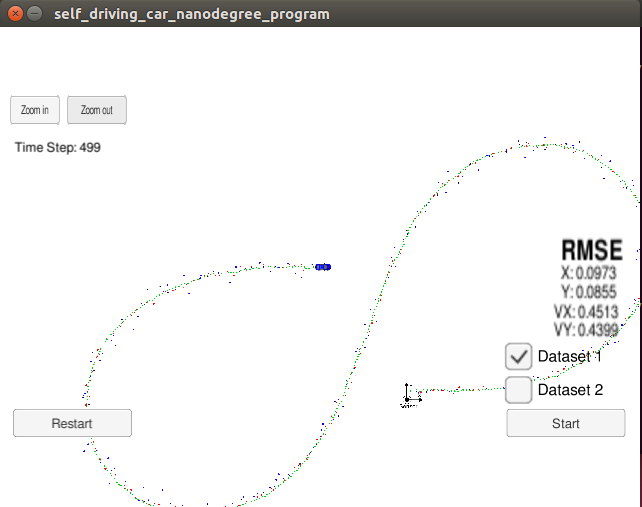
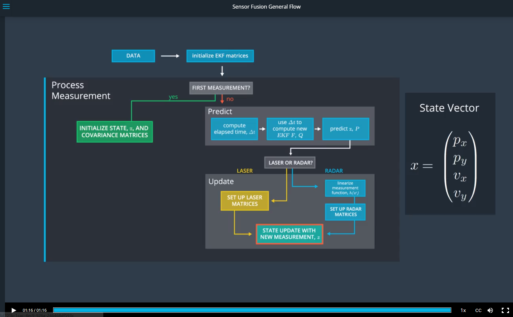

# Extended Kalman Filter Project Starter Code
Self-Driving Car Engineer Nanodegree Program

In this project I will utilize a kalman filter to estimate the state of a moving object of interest with noisy lidar and radar measurements. 

The goals / steps of this project are the following:

* Your code should compile.
* px, py, vx, vy output coordinates must have an RMSE <= [.11, .11, 0.52, 0.52] when using the file: "obj_pose-laser-radar-synthetic-input.txt" which is the same data file the simulator uses for Dataset 1.
* Your Sensor Fusion algorithm follows the general processing flow as taught in the preceding lessons. 
* Your Kalman Filter algorithm handles the first measurements appropriately.  
* Your Kalman Filter algorithm first predicts then updates. 
* Your Kalman Filter can handle radar and lidar measurements.
* Your algorithm should avoid unnecessary calculations. 


### [Rubric](https://review.udacity.com/#!/rubrics/748/view) Points
### Here I will consider the rubric points individually and describe how I addressed each point in my implementation.  

#### Your code should compile.
I compile project by following instructions:

1. mkdir build
2. cd build
3. cmake ..
4. make
5. ./ExtendedKF

#### px, py, vx, vy output coordinates must have an RMSE <= [.11, .11, 0.52, 0.52] when using the file: "obj_pose-laser-radar-synthetic-input.txt" which is the same data file the simulator uses for Dataset 1.
My RMSE is [.1057, .0953, 0.4981, 0.4716], here is a screenshot:
<div class="test">

</div>


#### Your Sensor Fusion algorithm follows the general processing flow as taught in the preceding lessons. 
Here is a screenshot in the lesson I am following by :
<div class="test">

</div>

#### Your Kalman Filter algorithm handles the first measurements appropriately.
By the first measurements, I initialized some variables:
ekf_.x_
ekf_.F_
ekf_.P_
ekf_.Q_ 
previous_timestamp_

  
#### Your Kalman Filter algorithm first predicts then updates. 
```
  ekf_.Predict();

  Hj_ = tools.CalculateJacobian(ekf_.x_);

  if (measurement_pack.sensor_type_ == MeasurementPackage::RADAR) {
    // Radar updates
    ekf_.R_ = R_radar_;
    ekf_.H_ = Hj_;
    ekf_.UpdateEKF(measurement_pack.raw_measurements_);

  } else {
    // Laser updates
    ekf_.R_ = R_laser_;
    ekf_.H_ = H_laser_;
    ekf_.Update(measurement_pack.raw_measurements_);

  }

```

#### Your Kalman Filter can handle radar and lidar measurements.
I defined a function to convert the Cartesian  coordinates to the Polar coordinates:
```
VectorXd KalmanFilter::ConvertCartesianToPolar(const VectorXd& cartesianvalue)
```

#### Your algorithm should avoid unnecessary calculations.
I tried to do it, but I can't confirm that I did the best.

